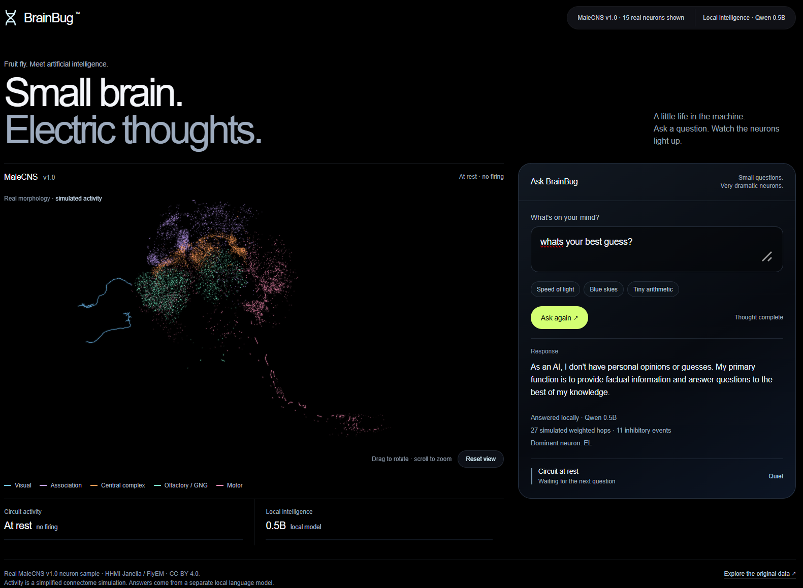
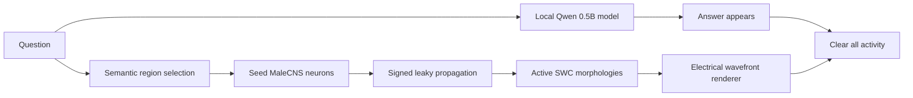

# BrainBug

> **Small brain. Electric thoughts.**

BrainBug is a playful local-AI experiment built by **Robillionair OÜ**. It places a very small language model beside a sampled real fruit-fly connectome and turns the wait for an answer into a living, electrical visualization.



The project asks a deliberately strange question: **what might useful computation feel like if it had to fit into the scale and energy culture of a biological nervous system?** BrainBug does not run a language model inside a fly brain. It uses conventional local hardware, a tiny Qwen model, real MaleCNS morphology, and an intentionally simplified firing simulation to make that thought experiment visible.

## Why BrainBug exists

Modern AI is usually presented through datacenters, enormous parameter counts, and invisible computation. A fruit fly represents the opposite aesthetic: a compact biological system performing sensing, navigation, learning, and action under severe energy and space constraints.

BrainBug was built as a fun way to explore that contrast. It is part science visualization, part local-AI demo, and part speculative interface. The project is interested in:

- the theoretical limits of useful computation at extremely low power;
- how much behavior can emerge from a compact network;
- what an AI interface feels like when computation is visible rather than hidden;
- the beauty of real connectome morphology; and
- the gap between biological intelligence, graph simulation, and language-model inference.

No energy-efficiency result is claimed. BrainBug does not measure the power consumption of a fly brain, the local model, or the user's computer. It is an invitation to think about those questions and a platform for future experiments that could measure them properly.

## What you are looking at

BrainBug combines three separate systems:

| Layer | What it does | Status |
| --- | --- | --- |
| MaleCNS data | Supplies real neuron identities, weighted connections, predicted neurotransmitter labels, and SWC morphology coordinates | Real public scientific data, sampled and bundled locally |
| Activity simulation | Seeds neurons from the prompt and propagates signed, leaky activity through the sampled graph | Simplified conceptual simulation |
| Local language model | Produces the text answer | Real Qwen2.5 0.5B inference on conventional local hardware |

The answer and the firing visualization run in parallel. The firing pattern is a visual interpretation of the question's route through the sampled connectome. It is not the language model's hidden activation state, and the fly connectome does not generate the answer.

## Features

- **Real MaleCNS v1.0 morphology.** The viewer draws bundled SWC neuron segments using their original 3D coordinates.
- **Movable 3D specimen.** Drag to rotate, use the wheel to zoom, or use the keyboard.
- **Electrical activity.** Blue-white wavefronts run along active neuron branches while the local model is thinking.
- **True resting state.** Every trace, interval, and activity indicator stops when an answer or error arrives.
- **Pure black specimen chamber.** No grid or decorative geometry competes with the connectome.
- **Small local model.** Qwen2.5 0.5B Instruct Q4_K_M is about 469 MiB and runs through llama.cpp.
- **No cloud inference.** Questions remain on the computer running BrainBug.
- **Offline fallback.** A small built-in fact set keeps the interaction demonstrable if the model runtime is unavailable.
- **No frontend dependencies.** The interface is plain HTML, CSS, Canvas 2D, and JavaScript.
- **Responsive and accessible controls.** The interface supports narrow screens, visible focus, keyboard rotation, and reduced-motion preferences.

## How it works



### 1. Prompt routing

The browser hashes the prompt and chooses a broad biological grouping from simple semantic cues. The current groupings are visual, association, central complex, olfactory/GNG, and motor. The hash makes repeated prompts deterministic enough for a recognizable route while still distributing different prompts through different graph nodes.

### 2. Connectome simulation

The simulation starts with up to eight real graph neurons. On each step it:

1. leaks the existing membrane-like value by a factor of `0.84`;
2. follows outgoing weighted connections;
3. applies positive or negative gain from the source neuron's predicted neurotransmitter label;
4. selects neurons crossing the threshold; and
5. stores the firing frame for visualization and summary statistics.

This is inspired by leaky integrate-and-fire ideas, but it is not a calibrated biophysical model. It omits ion channels, morphology-dependent propagation delays, plasticity, neuromodulation, glia, body feedback, and many other mechanisms necessary for biological fidelity.

### 3. Morphology rendering

The Canvas renderer projects original 3D SWC coordinates into a movable perspective view. Resting neurons remain visible as fine colored structures. During thinking, a moving distance band illuminates connected branch segments with a blue halo and white core. This creates a lightning-like wave without replacing the source geometry with invented shapes.

### 4. Local answer generation

The Node.js server starts a local llama.cpp server and sends it a short factual-assistant prompt. The default model is:

```text
Qwen/Qwen2.5-0.5B-Instruct-GGUF
quantization: Q4_K_M
context: 1536 tokens
maximum answer: 160 tokens
temperature: 0.2
```

The model is intentionally small. It can answer many simple factual questions and perform small transformations, but it will be less accurate, less fluent, and less capable than a modern large model.

## Quick start

Clone the repository and enter it:

```bash
git clone https://github.com/Rob-bio4/Brainbug.git
cd Brainbug
```

### Requirements

- Node.js 20 or newer
- approximately 700 MiB of free disk space for the local runtime and model
- an internet connection for the initial setup only
- Windows x64, macOS, or a supported 64-bit Linux system

No npm packages are required.

### Windows

From the repository directory:

```powershell
npm run setup:windows
npm start
```

Open <http://localhost:4173>.

The setup script downloads the latest official Windows x64 CPU build of llama.cpp and Qwen2.5 0.5B Instruct Q4_K_M into `runtime/`. That directory is ignored by Git.

### macOS and Linux

From the repository directory:

```bash
chmod +x scripts/setup-unix.sh
./scripts/setup-unix.sh
npm start
```

Open <http://localhost:4173>.

The Unix setup script selects an official llama.cpp build for macOS arm64/x64 or Ubuntu arm64/x64. On another distribution, install `llama-server` yourself and provide its absolute path:

```bash
LLAMA_SERVER=/absolute/path/to/llama-server npm start
```

Place the model at:

```text
runtime/qwen2.5-0.5b-instruct-q4_k_m.gguf
```

### Use another port

PowerShell:

```powershell
$env:PORT=4176
npm start
```

Bash:

```bash
PORT=4176 npm start
```

If port `8081` is already used by another local inference server, set `LLAMA_PORT` in the same way.

## Controls

| Action | Mouse or touch | Keyboard |
| --- | --- | --- |
| Rotate the specimen | Drag | Arrow keys while the canvas is focused |
| Zoom | Mouse wheel or trackpad scroll | `+` and `-` while the canvas is focused |
| Reset camera | Select **Reset view** | Tab to **Reset view**, then Enter |
| Ask | Select **Ask the brain** | Ctrl+Enter or Command+Enter in the question field |

The example prompts are useful smoke tests:

- What is the speed of light?
- Why is the sky blue?
- What is 17 times 23?

## Repository layout

```text
brainbug/
├── public/
│   ├── index.html             # Interface and cold biological visual system
│   ├── app.js                 # 3D projection, simulation, activity, interaction
│   └── mcns-data.js           # Bundled MaleCNS graph and SWC sample
├── docs/
│   └── brainbug.png           # Repository screenshot
├── scripts/
│   ├── setup-windows.ps1      # Windows llama.cpp and model installer
│   ├── setup-unix.sh          # macOS/Linux installer
│   └── build-mcns-data.mjs    # Refreshes the bundled public-data sample
├── test/
│   └── activity.mjs           # Verifies the activity lifecycle and black canvas
├── server.mjs                 # Static server and local model bridge
├── package.json
├── CITATION.cff
├── CONTRIBUTING.md
├── THIRD_PARTY_NOTICES.md
└── LICENSE
```

## Development

The frontend has no build step. Edit the files in `public/`, restart the server only when `server.mjs` changes, and reload the browser.

Run the verification suite:

```bash
npm test
```

The activity test executes the real frontend in a controlled JavaScript context and checks that:

- the canvas is pure black;
- the resting specimen does not animate;
- electrical cores appear while a request is pending;
- activity continues if the local model takes longer than the visual phases;
- success and failure both clear the active neurons and interval;
- repeated questions remain usable; and
- no old sphere or expanding-ring effect is drawn.

## Refreshing the MaleCNS sample

The repository already includes the data required to run BrainBug. A refresh is optional and requires network access:

```bash
npm run refresh:connectome
```

The script queries the public `male-cns:v1.0` neuPrint dataset for graph metadata and weighted connections, then retrieves selected SWC files from the public MaleCNS storage bucket. It selects three rendered skeletons from each of five broad classes and limits segment density to keep browser rendering practical.

Review every generated data diff before committing it. The upstream dataset is authoritative; the bundled file is a visualization sample.

## Data included in this version

The current bundled sample contains:

- 604 graph neurons;
- 600 weighted connections;
- 15 rendered SWC neuron skeletons;
- three rendered morphologies for each of five interface groupings; and
- predicted neurotransmitter metadata where available.

The full MaleCNS dataset is much larger. BrainBug deliberately bundles a compact selection so the page loads immediately and stays interactive on ordinary hardware.

## Privacy and network behavior

After the initial setup, normal questions are sent only from the browser to the local Node.js server and from that server to llama.cpp on `127.0.0.1`. BrainBug does not include analytics, accounts, telemetry, cookies, advertising, or a cloud model key.

Network access occurs only when you choose to:

- run a setup script, which downloads llama.cpp and the model;
- refresh the connectome sample; or
- open an external credit or source link.

The server binds the public app to the local machine by default. Do not expose it to an untrusted network without adding appropriate access controls.

## Performance and low-power experiments

Qwen2.5 0.5B was chosen because it is small enough to run locally on modest hardware while still answering simple questions. The default server uses CPU inference (`-ngl 0`) for compatibility. Startup may take a few seconds; later prompts should be faster while the model remains loaded.

BrainBug's current UI does not report watts, joules per token, or biological equivalence. A serious low-power experiment would need controlled measurements of:

- idle and loaded system power;
- model-load energy separated from per-prompt energy;
- prompt and completion token counts;
- inference latency and throughput;
- CPU/GPU selection and quantization;
- thermal and background-process effects; and
- a clearly defined comparison target for biological computation.

Those measurements would make an excellent future companion to the visual thought experiment.

## Troubleshooting

### “Built-in facts · model unavailable”

Confirm that these files exist:

```text
runtime/llama-server.exe                 # Windows
runtime/llama-server                     # macOS/Linux
runtime/qwen2.5-0.5b-instruct-q4_k_m.gguf
```

Run the setup script again. On Windows, use `npm run setup:windows`. If you installed llama.cpp elsewhere, set `LLAMA_SERVER` to its absolute path.

### The first answer is slow

The first request may include model startup and loading. Leave the server running between questions. The electrical activity continues until the request finishes.

### The page does not open

Check the terminal for the exact local URL. If port 4173 is busy, set another `PORT` before starting the app.

### The brain is visible but will not move

Drag inside the specimen area. For keyboard control, click or tab to the canvas first, then use arrow keys and `+`/`-`.

### The connectome refresh fails

The refresh depends on public MaleCNS, neuPrint, and storage endpoints. The checked-in data remains usable when those services are unavailable.

## Scientific scope and limitations

BrainBug is an educational and artistic software experiment. It is not:

- an emulation of a complete fly nervous system;
- a validated biophysical simulator;
- evidence that a fruit fly can perform language tasks;
- a visualization of Qwen's internal neurons;
- a benchmark of biological versus silicon intelligence; or
- a medical, scientific, or engineering analysis tool.

The project is most useful when those boundaries remain explicit. The real data gives the visualization biological structure; the simplified dynamics make activity legible; the tiny local model makes the interface functional.

## Credits

### Builder

**BrainBug was conceived and built by Robillionair OÜ.**

### Connectome data and inspiration

Deep thanks to the **FlyWire community**, **HHMI Janelia FlyEM**, the **MaleCNS team**, neuPrint contributors, proofreaders, researchers, and everyone whose work makes public connectome exploration possible.

- MaleCNS v1.0: <https://male-cns.janelia.org/>
- FlyWire: <https://flywire.ai/>
- FlyWire Codex: <https://codex.flywire.ai/>
- neuPrint: <https://neuprint.janelia.org/>

For research use, cite the official publications and dataset version requested by the relevant project. Detailed data and dependency notices are in [THIRD_PARTY_NOTICES.md](THIRD_PARTY_NOTICES.md).

### Local intelligence

- Qwen2.5 0.5B Instruct GGUF: <https://huggingface.co/Qwen/Qwen2.5-0.5B-Instruct-GGUF>
- llama.cpp: <https://github.com/ggml-org/llama.cpp>

BrainBug is an independent project and is not affiliated with or endorsed by FlyWire, HHMI Janelia, Qwen, Hugging Face, or llama.cpp.

## Citation

If BrainBug contributes to a project, exhibition, article, or experiment, cite the repository and credit Robillionair OÜ. A machine-readable citation is provided in [CITATION.cff](CITATION.cff). Also cite the official MaleCNS/FlyWire sources appropriate to your use of the data.

## License

BrainBug's original application code is available under the [MIT License](LICENSE), copyright © 2026 Robillionair OÜ.

The MaleCNS-derived data in `public/mcns-data.js` remains subject to its source attribution and CC BY 4.0 terms. Downloaded models and binaries retain their upstream licenses. See [THIRD_PARTY_NOTICES.md](THIRD_PARTY_NOTICES.md).
